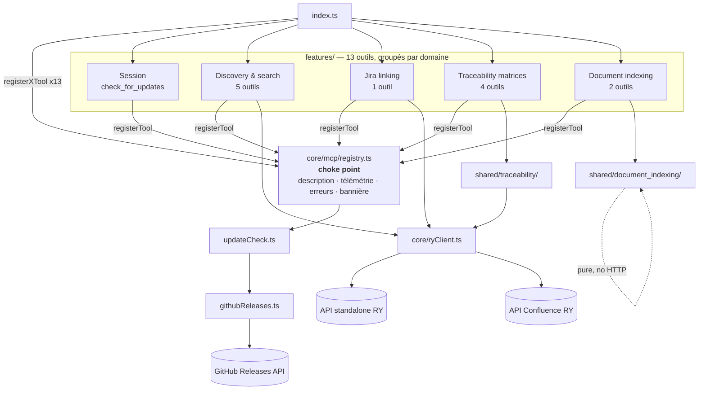

# Architecture — ry-ai-assistant (Requirement Yogi AI Assistant MCP server)

> Document généré par lecture et compréhension du code (assistée par un graphe de
> dépendances factuel produit avec `madge`). À date du 2026-08-10. Décrit l'architecture
> RÉELLEMENT observée dans le code (y compris l'état intermédiaire d'un refactor en
> cours dans le working tree), pas une cible théorique.

## 1. Vue d'ensemble

Un serveur **MCP** (Model Context Protocol) en TypeScript/ESM, exposé en **stdio**, qui
donne à un LLM client (Claude Desktop, Claude Code, Cursor…) 13 outils pour manipuler
des macros **Requirement Yogi** dans Confluence (format ADF) et dans l'API Requirement
Yogi elle-même (recherche, liens Jira, matrices de traçabilité). Ce n'est pas un outil
de rédaction : sa seule valeur ajoutée est d'encoder — côté serveur, de façon
déterministe — les règles Requirement Yogi que le LLM ne peut pas connaître (où une
macro peut vivre dans une page ADF, quelles colonnes une matrice peut réellement
contenir). Le LLM fait la décomposition métier (arbre d'exigences, plan d'édition,
requête RQL) ; le serveur ne fait aucun appel LLM lui-même.

Stack : TypeScript + Node.js (ESM), `@modelcontextprotocol/sdk`, Zod v4 pour toute la
validation d'entrée/sortie, `esbuild-wasm` pour le bundling auto-suffisant, Vitest pour
les tests.

Découpage : **par fonctionnalité** (13 dossiers `src/features/<tool>/`), avec deux
couches transverses en dessous (`shared/` pour le code réellement partagé entre
plusieurs outils, `core/` pour l'infrastructure générique). Pas de couche "service"
générique séparée du reste — la logique métier vit soit dans le fichier `tool.ts` de la
feature (si elle lui est propre), soit dans `shared/<domaine>/` (si plusieurs outils la
consomment).

**Refactor en cours (working tree, non commité) :** un renommage `src/tools/` →
`src/features/` et `src/shared/adf/` → `src/shared/document_indexing/` a déjà été
appliqué aux fichiers source, mais `scripts/embed-docs.mjs` référence encore l'ancien
chemin `src/tools` — voir §8.

## 2. Carte des modules

| Module / dossier | Rôle réel | Dépend de | Utilisé par | Notes |
|---|---|---|---|---|
| `src/index.ts` | Point d'entrée du process : instancie `McpServer`, lance `startUpdateCheck()`, enregistre les 13 outils, connecte le transport stdio. | Tous les `features/*/tool.ts`, `core/updateCheck.ts`, `version.generated.ts` | — (point d'entrée) | Orphelin dans le graphe madge (normal — c'est le point d'entrée) |
| `src/core/mcp/registry.ts` | Le **choke point** : `registerTool()` branche description (résolue par nom), télémétrie best-effort, bannière de mise à jour, et transforme toute erreur jetée en résultat `isError` avec la `guidance` de sa classe. C'est ce qui permet aux handlers d'outils de ne jamais avoir de `try/catch`. | `ryClient.ts` (télémétrie), `updateCheck.ts`, `prompts/descriptions.ts`, `errors.ts`, `log.ts`, `toolNames.ts` | Les 13 `tool.ts` | Module le plus dépendu du repo (13 dépendants) |
| `src/core/mcp/toolNames.ts` | Source de vérité unique des 13 noms d'outils (`TOOL_NAMES` + type `ToolName`). | — | `registry.ts`, `prompts/descriptions.ts` | Un nom oublié ici = erreur de compilation dans `descriptions.ts` |
| `src/core/ryClient.ts` | Client HTTP vers les APIs Requirement Yogi (classe `RyClient`, instance partagée paresseuse `ryClient()`). Transport pur : construit les URLs/headers selon l'API (standalone vs Confluence), gère la pagination, résout et met en cache organisation/instance Confluence, relaie les erreurs 4xx/5xx verbatim. | `env.ts`, `errors.ts`, `dto.ts`, `shared/traceability/dto.ts`, `log.ts` | 9 modules (toutes les features qui appellent l'API) | Deuxième module le plus dépendu (9). Classe plutôt que singletons de module pour permettre un client "propre" par test |
| `src/core/dto.ts` | Frontière typée (Zod, `looseObject`) avec les DTO génériques de l'API RY (organisations, applications, relationships, requirement, résultat de recherche, résultat de lien Jira). Schémas volontairement laxistes (champs `nullish`) tant que les endpoints ne sont pas confirmés. | `errors.ts`, `log.ts` | `ryClient.ts` et 7 autres | 8 dépendants |
| `src/core/errors.ts` | Taxonomie d'erreurs (`RyConfigError`, `RyAmbiguityError`, `RyConnectionError`, `RyApiError`, `RyResponseError`), chacune avec une `guidance` écrite une seule fois. `formatToolFailure` rend le texte final vu par le LLM. | — | 7 modules | Zéro dépendance sortante — module racine de la taxonomie |
| `src/core/log.ts` | `logDev` : traçage STDERR en mode dev uniquement (jamais de tokens ni d'arguments d'outil). | `env.ts` | `dto.ts`, `ryClient.ts`, `registry.ts`, `matrixColumns.ts` (indirect) | — |
| `src/core/updateCheck.ts` | État de session du check de mise à jour : lance le check GitHub une fois au démarrage, expose une bannière "update available" one-shot consommée par `registry.ts`. Module séparé de `registry.ts` pour casser un cycle d'import. | `githubReleases.ts`, `version.generated.ts` | `registry.ts`, `check_for_updates/tool.ts` | — |
| `src/core/githubReleases.ts` | Appel GET best-effort à `api.github.com/repos/.../releases/latest` + comparaison semver. Ne lève jamais (offline/403/404 → `{checked:false}`). | — | `updateCheck.ts`, `check_for_updates/tool.ts` | — |
| `src/env.ts` | `isDevEnv()` / `requireDevValue()` — bascule dev/prod et garde-fou sur les valeurs bakées à la compilation par esbuild `--define`. | `core/errors.ts` | `ryClient.ts`, `shared/document_indexing/macro.ts` | Les valeurs bakées ne peuvent être lues qu'en accès statique `process.env.<NOM>` (contrainte esbuild) |
| `src/shared/traceability/dto.ts` | Contrat complet des matrices de traçabilité : enum fermé `STEP_TYPES` (23 valeurs), types `MatrixColumn`/`MatrixDefinition` (ce qu'on ENVOIE, TypeScript pur), schémas `ColumnSuggestions`/`SavedMatrix` (ce qu'on REÇOIT, Zod). | Zod uniquement | `ryClient.ts`, `matrix.ts`, `matrixColumns.ts`, 4 `tool.ts` | 7 dépendants — deuxième domaine le plus central après `core/` |
| `src/shared/traceability/matrix.ts` | Les deux boucles métier : découverte (un aller-retour par niveau de profondeur de colonnes) et validation-puis-persistance (chaque colonne re-vérifiée contre les suggestions live avant écriture, tout ou rien). Gère aussi la préservation des champs non répétés lors d'une mise à jour (PUT complet). | `ryClient.ts`, `errors.ts`, `log.ts`, `dto.ts`, `matrixColumns.ts` | `discover_matrix_columns`, `save_traceability_matrix`, `get_traceability_matrix`, `list_traceability_matrices` | Cœur métier de la use-case 4 |
| `src/shared/traceability/matrixColumns.ts` | Fonctions PURES (aucun HTTP) : traduit les suggestions API en colonnes candidates, résout une colonne demandée contre les suggestions et la rejette si les données ne la supportent pas. Encode les 3 pièges connus (inversion FROM/TO, flags `all*` = "déjà utilisé" et non "non supporté", nécessité d'un échantillon complet). | `prompts/descriptions.ts`, `dto.ts` | `matrix.ts`, 4 `tool.ts` | Contient l'exhaustiveness-check compilateur sur `STEP_TYPES` (voir §7) |
| `src/shared/traceability/toolInputs.ts` | Schéma Zod d'entrée partagé verbatim par `discover_matrix_columns` et `save_traceability_matrix` (colonnes, guidance d'erreur). | Zod | `discover_matrix_columns/tool.ts`, `save_traceability_matrix/tool.ts` | — |
| `src/shared/document_indexing/render.ts` | Rendu déterministe arbre-d'exigences → ADF : décide table / paragraphe / heading selon la présence de `children`/`properties`. C'est **la** logique métier des use cases 1 et 2. | `requirementsTree.ts`, `macro.ts` | `build_requirements_adf/tool.ts`, `edit_page_requirements/tool.ts` | Fonctions pures, couvertes par tests |
| `src/shared/document_indexing/macro.ts` | Construit le noeud ADF `inlineExtension` de la macro RY (source unique pour les deux outils ADF). | `env.ts` | `render.ts`, `edit_page_requirements/tool.ts` | Encode l'URI Forge (app id constant + environment id dev/prod) |
| `src/shared/document_indexing/requirementsTree.ts` | Schéma Zod + types TS de l'arbre d'exigences en entrée de `build_requirements_adf`. | Zod | `render.ts`, `build_requirements_adf/tool.ts` | — |
| `src/shared/jira-linking/prompts/jira-workflow.md` | Fragment de prompt partagé par les 6 outils de la use case 3 (pas de code TS). | — | `prompt.md` des 6 outils Jira (via `{{include:}}`) | — |
| `src/shared/rql/prompts/search-syntax.md` | Enveloppe qui inclut `src/docs/search-syntax-prompt-v3.md` (référence RQL faisant autorité). | `src/docs/search-syntax-prompt-v3.md` | `search_requirements` ET `discover_matrix_columns` | Seul fragment partagé ENTRE deux domaines différents, d'où son propre dossier `shared/rql/` |
| `src/features/*/tool.ts` (13 dossiers) | Un `registerTool()` par outil : schéma Zod d'entrée/sortie + handler fin qui délègue à `shared/` ou `core/`, sans `try/catch` (les erreurs sont jetées et gérées par `registry.ts`). | `core/mcp/registry.ts` + le `shared/` de leur domaine | `src/index.ts` | Taille très hétérogène : de 30 lignes (`check_for_updates`) à 89 (`search_requirements`, `save_traceability_matrix`) |
| `src/features/edit_page_requirements/tool.ts` | Seule feature avec de la logique non triviale EN PLUS du wrapper : manipulation d'arbre ADF (`anchoredInject`, `applyReplace`, `applyInsertAfter`) pour les 4 modes d'opération (`inline`/`paragraph`/`table`/`insert`), avec repérage par texte d'ancrage et splice au conteneur le plus profond. | `document_indexing/macro.ts`, `document_indexing/render.ts`, `core/mcp/registry.ts` | `src/index.ts` | ~350 lignes — la feature la plus grosse du repo |
| `src/features/link_requirements_to_jira/jiraLinking.ts` | Traduit le vocabulaire MCP (snake_case) en `DTORequirementSelection`, exécute le batch **séquentiellement** (pour que le cache d'instance se réchauffe avant les appels suivants) avec échec par opération sans avorter le lot. | `ryClient.ts`, `dto.ts` | `link_requirements_to_jira/tool.ts` | Un des deux seuls `catch` hors `registry.ts` justifiés par un commentaire |
| `src/features/list_searchable_fields/schemaGrounding.ts` | Échantillonne jusqu'à 1000 requirements (`key ~ '%'`) pour extraire propriétés/relations/variants/règles réels d'un espace, afin d'empêcher le LLM d'inventer des noms de champ RQL. | `ryClient.ts`, `dto.ts` | `list_searchable_fields/tool.ts` | Lance la requête `/relationships` en parallèle de la pagination `/rest/search` |
| `src/features/search_requirements/dto.ts` | Contrat de SORTIE propre à cet outil (`RequirementSummarySchema`), projeté depuis le DTO `core/dto.ts` via `projectOn`. | `core/dto.ts` (types) | `search_requirements/tool.ts` | Exemple du principe "chaque feature possède son contrat de sortie" |
| `src/prompts/descriptions.ts` | Accès typé aux prompts générés : `toolDescription(name)` et `columnMeaning(type)`, avec double vérification à la compilation (aucun outil sans prompt.md, aucun prompt.md orphelin ; idem pour la glose des types de colonne). | `index.generated.ts` (généré), `toolNames.ts`, `traceability/dto.ts` | `registry.ts`, `matrixColumns.ts` | Le fichier `index.generated.ts` est généré par `scripts/embed-docs.mjs` et git-ignoré |
| `src/version.generated.ts` | Version générée depuis `package.json` par `embed-docs.mjs`. | — | `index.ts`, `updateCheck.ts` | Généré, git-ignoré |
| `scripts/embed-docs.mjs` | Codegen : concatène tous les `prompt.md` (avec résolution de `{{include:}}`) + `matrix_columns.md` en `src/prompts/index.generated.ts`, et bake la version. | — | Étape `pretest`/`pretypecheck`/`compile`/`build:*` | **Actuellement cassé** dans le working tree — voir §8 |
| `scripts/build-bundle.mjs` | Bundling esbuild-wasm avec `define` pour figer les valeurs dev/prod à la compilation, produit `release/*.mjs` auto-suffisant. | `embed-docs.mjs` (généré au préalable) | `npm run build:prod` / `build:dev` | — |

## 3. Diagramme des dépendances / flux

> **Carte détaillée (schéma dessiné, avec les 13 outils, les couleurs par catégorie de
> flux, et les deux pièges de la traçabilité illustrés séparément) :**
> [ry-ai-assistant — Architecture Map](https://claude.ai/code/artifact/371dcaf7-4b27-42b4-a105-e2ff7a7d733a)
> — la version ci-dessous est volontairement réduite à l'essentiel pour rester lisible
> dans un lecteur Markdown/GitHub.



Flux de haut niveau (comment une requête traverse le système) :

```
LLM appelle un outil
  → SDK MCP → withTelemetry (registry.ts) : ping télémétrie best-effort, trace dev
    → handler du tool.ts (validation Zod déjà faite par le SDK)
      → shared/<domaine> (logique métier pure ou orchestrée) ou directement ryClient()
        → RyClient.request() → fetch() vers l'API standalone ou Confluence RY
          → parseApi/parseApiItems (dto.ts) : shape mismatch → RyResponseError
      ← résultat typé ou RyError jetée
  ← registry.ts transforme une erreur jetée en { isError: true, content } avec guidance
  ← bannière "update available" éventuellement préfixée (one-shot, 1er appel réussi)
```

## 4. Points d'entrée

Un seul point d'entrée process (`src/index.ts`, transport stdio), qui expose 13 outils
MCP — ce sont eux, individuellement, les "routes" du système.

| Point d'entrée | Type | Ce qu'il fait concrètement | Modules impliqués |
|---|---|---|---|
| `check_for_updates` | Outil MCP | Re-check à la demande de la dernière release GitHub (le check auto tourne déjà au boot). | `updateCheck.ts`, `githubReleases.ts` |
| `build_requirements_adf` | Outil MCP | Transforme un arbre d'exigences JSON en document ADF prêt à publier (use case 1). | `document_indexing/render.ts`, `requirementsTree.ts` |
| `edit_page_requirements` | Outil MCP | Applique un plan d'opérations (`inline`/`paragraph`/`table`/`insert`) sur un ADF de page existante (use case 2). | `document_indexing/*`, logique locale de splice ADF |
| `list_organizations` / `list_applications` / `list_relationships` | Outils MCP | Découverte : organisations, instances connectées, types de relation (use case 3). | `ryClient.ts` (API standalone) |
| `list_searchable_fields` | Outil MCP | Grounding de schéma : identifiants réels d'un espace avant d'écrire du RQL. | `schemaGrounding.ts` |
| `search_requirements` | Outil MCP | Recherche RQL des requirements, résultat trimé aux besoins du linking. | `ryClient.ts`, `search_requirements/dto.ts` |
| `link_requirements_to_jira` | Outil MCP | Crée les liens RY↔Jira en lot, avec échec par opération. | `jiraLinking.ts` |
| `discover_matrix_columns` | Outil MCP | Un aller-retour de découverte des colonnes possibles à un niveau de profondeur donné (use case 4). | `traceability/matrix.ts`, `matrixColumns.ts` |
| `save_traceability_matrix` | Outil MCP | Valide toutes les colonnes puis persiste (ou refuse et n'écrit rien). | `traceability/matrix.ts` |
| `get_traceability_matrix` / `list_traceability_matrices` | Outils MCP | Lecture d'une matrice sauvegardée / recherche paginée. | `traceability/matrix.ts` |

## 5. Appels réseau et dépendances externes

| Appel / service externe | Où (fichier/module) | Contexte d'usage | Remarques |
|---|---|---|---|
| API standalone RY (`/applications`, `/organizations`, `/relationships`, `/telemetry`) | `core/ryClient.ts` (`requestStandalone`) | Sur appel d'outil (découverte use case 3) et à CHAQUE outil (télémétrie fire-and-forget, non attendue) | Auth `Authorization: Bearer <token>` ; pagination par `offset`/`limit`, s'arrête sur `total` plutôt que sur la taille de page (le serveur peut plafonner la limite demandée) |
| API Confluence RY (`/rest/search`, `/rest/jira-bulk/links`, `/rest/traceability/{space}`, `/rest/saved-matrices*`) | `core/ryClient.ts` (`requestConfluence`) | Sur appel d'outil (recherche, liens Jira, matrices) | Auth `X-Api-Key` + `X-Base-Url` (résolu et caché via `/applications` si une seule instance Confluence active est connectée) |
| GitHub Releases API (`api.github.com/repos/.../releases/latest`) | `core/githubReleases.ts` | UNE fois au démarrage du process (`startUpdateCheck()`), résultat caché en mémoire toute la session | Best-effort strict : offline/403/404 → `{checked:false}`, ne lève jamais |

Aucune base de données, aucun cache externe, aucune file de messages. Tout l'état est en
mémoire process (le cache d'organisation/instance de `RyClient`, l'état de session du
check de mise à jour) — cohérent avec un process stdio à courte durée de vie par
session client.

## 6. Flux de données principaux

### Use case 1 — Créer une page depuis un arbre d'exigences

```
LLM décompose la demande utilisateur en RequirementsTree
  → build_requirements_adf (validation Zod de l'arbre)
    → renderNodes() (render.ts) : récursif, décide heading/table/paragraph
      → buildInlineExtension() (macro.ts) pour chaque clé de requirement
  ← document ADF { version, type: "doc", content: [...] }
LLM publie via l'Atlassian MCP (createConfluencePage, contentFormat: "adf")
```

### Use case 2 — Éditer une page existante

```
LLM récupère l'ADF de la page (Atlassian MCP getConfluencePage)
LLM analyse le texte, propose un plan d'opérations typées
  → edit_page_requirements(page_adf, operations[])
    pour chaque opération :
      inline    → anchoredInject() : remplace le texte ancre par une macro, in place
      paragraph → applyReplace() : splice un bloc paragraphe au conteneur le + profond
      table     → applyReplace() : idem avec un bloc table
      insert    → applyInsertAfter() ou append en fin de document
  ← ADF modifié + résumé des opérations appliquées/ignorées (ancre non trouvée)
LLM publie via updateConfluencePage (version + 1)
```

### Use case 3 — Lier des exigences à Jira

```
list_searchable_fields(space)      → grounding (échantillon de 1000 requirements)
search_requirements(query RQL)     → requirements RY trimés (id, key, container, variant…)
[Atlassian MCP] recherche/crée les issues Jira côté utilisateur
list_relationships(application_id) → types de relation disponibles
link_requirements_to_jira(links[]) → jiraLinking.createJiraLinkBatch()
                                       séquentiel, échec isolé par opération
  → POST /rest/jira-bulk/links par opération
  ← rapport { completed, failed, operations[] }
```

### Use case 4 — Matrice de traçabilité sauvegardée

```
discover_matrix_columns(query, columns=[])
  → matrix.ts:discoverMatrixColumns()
    → POST /rest/traceability/{space} avec colonne 0 + colonnes déjà choisies
    ← columnSuggestions (par colonne) → matrixColumns.ts:candidatesFor()
  ← candidats pour CHAQUE colonne déjà posée (un niveau de profondeur)
[LLM boucle : ajoute une colonne, rappelle discover_matrix_columns, jusqu'à validation utilisateur]

save_traceability_matrix(name, columns[])
  → matrix.ts:saveTraceabilityMatrix()
    pour chaque colonne, dans l'ordre :
      POST /rest/traceability/{space} SANS cette colonne (état où les flags sont valides)
      → matrixColumns.ts:resolveColumn() valide contre les suggestions ; rejet = arrêt immédiat
    si tout valide → toSavedMatrixPayload() → POST/PUT /rest/saved-matrices
  ← rapport { saved, matrix_id, columns[], warnings[], problems[] }
```

## 7. Choix d'architecture notables

- **Choke point unique pour l'enregistrement d'outils** (`core/mcp/registry.ts`) : décrit
  une seule fois la description (résolue par nom depuis le markdown généré), la
  télémétrie, la trace dev, et la transformation des erreurs jetées en résultat MCP —
  ce qui permet aux 13 handlers de n'avoir AUCUN `try/catch`.
- **Taxonomie d'erreurs à 5 classes** (`core/errors.ts`), chacune portant sa `guidance`
  actionable pour le LLM, écrite une seule fois plutôt que dupliquée par outil.
- **Frontière typée systématique côté réseau** (`core/dto.ts`, `shared/traceability/dto.ts`) :
  schémas Zod `looseObject` volontairement laxistes tant que les endpoints RY ne sont
  pas confirmés, MAIS deux granularités de rigueur bien distinctes : l'enveloppe d'une
  réponse (`parseApi`) échoue fort et fort, un item isolé dans une liste
  (`parseApiItems`) est simplement écarté et loggé — sauf `columnSuggestions`, qui reste
  un tableau POSITIONNEL non filtré car indexé par colonne.
- **Prompts comme données, jamais comme code** : chaque chaîne lue par le LLM vit dans un
  `prompt.md` (par dossier de feature) ou un `shared/**/prompts/*.md`, jamais dans un
  `.ts`. `scripts/embed-docs.mjs` les concatène en un module généré, avec une
  vérification bidirectionnelle à la COMPILATION (`descriptions.ts`) : un outil sans
  prompt, ou un prompt orphelin, est une erreur de build — pas une erreur silencieuse au
  runtime.
- **Enum de type de colonne fermé, gardé honnête par le compilateur** : ajouter une
  valeur à `STEP_TYPES` (`shared/traceability/dto.ts`) casse la compilation à exactement
  3 endroits (`DEFAULT_LABELS`, la section `## TYPE` du glossaire markdown via
  `descriptions.ts`, et le `switch` de `resolveColumn` dont la branche `default` force
  une assignation de type qui échoue si le nouveau type n'a pas de cas dédié). Un
  mécanisme complémentaire (`unmappedSuggestionFields`) détecte à l'exécution un champ de
  suggestion inconnu envoyé par l'API et le signale dans les notes, sans jamais planter.
- **Build dev/prod entièrement figé à la compilation** (`esbuild --define`) : la config
  MCP runtime (token + résidence des données) est identique en dev et prod ; seul le
  fichier `.mjs` pointé diffère. Contrainte notable : `esbuild --define` ne substitue
  que des accès statiques `process.env.<NOM>`, jamais `process.env[nom]` calculé — d'où
  le pattern `requireDevValue(name, process.env.<NAME>, ...)` répété littéralement.
- **Découverte itérative pour les matrices de traçabilité** : il n'existe aucun endpoint
  "liste des colonnes possibles" côté RY — le vocabulaire de colonnes est dérivé des
  données réellement présentes, donc la découverte est nécessairement UN aller-retour
  par niveau de profondeur, la boucle étant pilotée par le LLM appelant.
- **Batch Jira volontairement séquentiel** (`jiraLinking.createJiraLinkBatch`), pas
  parallèle : le premier appel résout et cache l'instance Confluence (et l'organisation),
  et paralléliser lancerait N résolutions redondantes plus N POST concurrents (risque de
  rate-limit).

## 8. Couplage fort et dette technique

- **Build cassé dans le working tree actuel.** `scripts/embed-docs.mjs:27` référence
  encore `resolve(root, "src/tools")`, alors que le renommage `src/tools/` →
  `src/features/` a déjà été appliqué aux sources (`git status` montre les `R` de
  renommage, non commités). Exécuter `node scripts/embed-docs.mjs` (donc `npm run
  compile`/`build`/`test`/`typecheck`) échoue actuellement avec
  `ENOENT: scandir '.../src/tools'`. C'est manifestement un refactor en cours plutôt
  qu'un oubli ancien (les commits récents s'appellent "Reorganize by feature (X/9)"), à
  finir avant de committer/pousser cet état.
- **Deux couches de responsabilité un peu différentes selon le domaine.** Les 4 outils de
  traçabilité délèguent presque toute leur logique à `shared/traceability/matrix.ts`
  (orchestration HTTP + règles métier), tandis qu'`edit_page_requirements/tool.ts`
  contient ~350 lignes de logique de manipulation ADF (`anchoredInject`, `applyReplace`,
  `applyInsertAfter`) directement dans le fichier de l'outil plutôt que dans
  `shared/document_indexing/`. Le CLAUDE.md du projet documente cette asymétrie comme
  volontaire ("logique utilisée par UN SEUL outil reste dans son propre dossier"), donc
  ce n'est pas un oubli, mais ça rend `edit_page_requirements/tool.ts` nettement plus
  gros et plus difficile à survoler que les 12 autres.
- **Aucune dépendance circulaire détectée par `madge`** sur `src/` (36 fichiers TS
  analysés), et un seul "orphelin" au sens du graphe d'import : `index.ts`, ce qui est
  attendu pour un point d'entrée.
- **Tests de bout en bout absents sur `edit_page_requirements`.** Les helpers purs
  (`applyReplace`/`anchoredInject`/`applyInsertAfter`) sont exportés et testés
  individuellement, mais il n'y a pas encore de test qui exerce le handler complet à
  travers les 4 modes d'opération (déjà noté comme item ouvert dans le CLAUDE.md du
  projet, §"What remains to be done").
- **Endpoints non confirmés contre la vraie API**, ce qui explique le choix délibéré de
  schémas Zod laxistes partout dans `core/dto.ts` et `shared/traceability/dto.ts` :
  `GET /organizations`, la forme exacte de `zephyrScaleFields`/`xrayFields`, et
  l'enveloppe de `POST /rest/saved-matrices/search`. Tant que ce n'est pas vérifié, une
  partie de la validation d'entrée reste volontairement permissive plutôt que stricte.

## Annexe — Statistiques du graphe de dépendances

Généré avec `madge --extensions ts` sur `src/` (l'analyse a dû cibler `src/` directement
avec `--extensions ts` : lancée sur la racine du repo sans ces options, `madge` ne
détecte aucun fichier TypeScript).

- **36 fichiers TypeScript** analysés (hors `.md`, `dist/`, `build/`, `release/`,
  `node_modules/`).
- **Aucune dépendance circulaire.**
- **1 orphelin** (non importé par un autre fichier) : `index.ts` — attendu, c'est le
  point d'entrée du process.
- **Modules les plus dépendus** (nombre de fichiers qui les importent) :

  | Module | Dépendants |
  |---|---|
  | `core/mcp/registry.ts` | 13 |
  | `core/ryClient.ts` | 9 |
  | `core/dto.ts` | 8 |
  | `core/errors.ts` | 7 |
  | `shared/traceability/dto.ts` | 7 |
  | `core/log.ts` | 4 |
  | `shared/traceability/matrix.ts` | 4 |
  | `shared/traceability/matrixColumns.ts` | 4 |
  | `shared/traceability/toolInputs.ts` | 4 |
